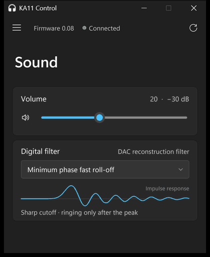
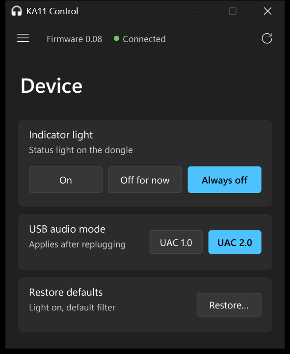
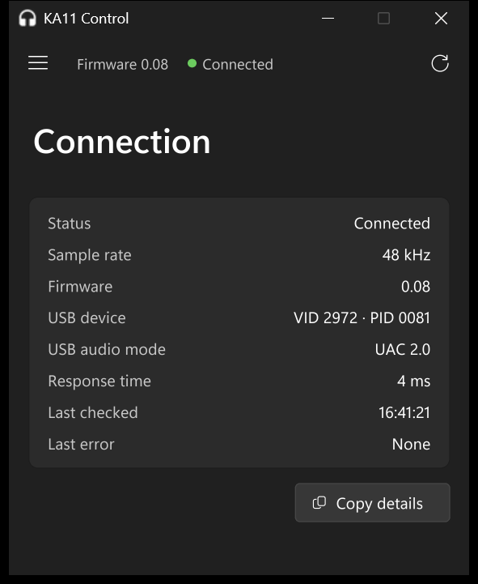

# KA11 Control

A small Windows app for changing the settings on a FiiO KA11 USB DAC: volume, digital filter, LED and USB audio mode.

<p align="center">
  
</p>

Not affiliated with FiiO in any way. FiiO and KA11 are their trademarks. Use at your own risk, and read the [volume notes](#volume) first.

## Why

FiiO's control app only supports the KA11 on Android. Their web app does the KA15 and KA17 but not the KA11. On Windows you just get the system volume slider, which can't touch the dongle's own settings.

I got tired of plugging the dongle into my phone to change a setting and then back into my PC. The KA11 talks over a plain HID interface that Windows already has a driver for, so I wrote this instead.

## How this was built

I built this with Claude Code. I set the direction, tested everything on my own KA11, and made the calls on design, safety and scope. Claude did most of the reverse engineering and code under my direction. The commits are co-authored to reflect that.

## What it does

- Device volume (0–50, 1 dB steps) and mute
- Digital filter: all five of the DAC's filters, each with a little impulse response diagram
- Indicator light: on, off for now, or always off
- USB audio mode: UAC 1.0 or 2.0 (takes effect after you replug)
- Restore defaults, like FiiO's app
- Connection page with sample rate, firmware, response time and the last error, plus a button to copy it all
- Follows your Windows light/dark mode and accent colour

| | | |
|---|---|---|
|  |  |  |

## Download

Get `KA11-Control.exe` from [releases](../../releases/latest) and run it. There's nothing to install.

It isn't signed, so SmartScreen will probably complain the first time. Click "More info" then "Run anyway", or build it yourself (see below).

Needs Windows 11, since it uses the Windows 11 fonts and icons.

## Volume

Windows' volume and the device volume share one attenuator inside the KA11. The app always sets it to Windows' volume plus the device volume (FiiO's app does the same), so it shouldn't ever be louder than you'd expect. If it can't read the Windows volume it won't change anything. It also asks before turning the volume up by more than 10 dB in one go.

That said, turn things down before plugging in sensitive IEMs.

## Command line

`ka11.py` also works on its own:

```bash
python ka11.py              # show current settings
python ka11.py set 30       # volume 0-50 (add --force for jumps over 10 dB)
python ka11.py filter 0     # 0-4
python ka11.py led off      # on, off-once, off
python ka11.py uac 2        # 1 or 2, applies after replugging
python ka11.py restore
```

## Running / building from source

```bash
pip install pillow
pythonw ka11_control.pyw
```

To build the exe:

```bash
pip install -r requirements.txt
python build.py
```

The filter diagrams are pregenerated in `filter_curves_data.py` so numpy doesn't end up in the exe. Run `python filter_shapes.py` if you change them.

## How it works

The KA11 has an HID interface next to its audio interface. The app sends it the same 16-byte commands FiiO's Android app does. The packet formats and registers are written up at the top of [`ka11.py`](ka11.py).

- `ka11.py`: the protocol and the CLI
- `winvolume.py`: reads the Windows volume for the KA11
- `ka11_control.pyw`: the UI
- `filter_shapes.py`: generates the filter diagrams
- `tools/probe_hid.py`: dumps HID info for a device, if you want to poke at other dongles

[usb-dongle-control](https://github.com/Tommy-Geenexus/usb-dongle-control) was a big help. Its KA13 code is what pointed me at the KA11's protocol.

A few notes:

- Only tested on firmware 0.08.
- The filter diagrams show what each filter type looks like in general. They aren't measured from the KA11.
- "Off for now" is FiiO's "turn off once". I'm assuming it lasts until you replug.
- FiiO's app has a headphone detection setting for this family of dongles but hides it for the KA11, so I've left it out too.

## Bugs and feedback

[Open an issue](../../issues/new/choose). The bug report form asks for the text from the Connection page's "Copy details" button, which covers most of what I need. If you're on a firmware other than 0.08, I'd love to hear whether it works.

## License

MIT
